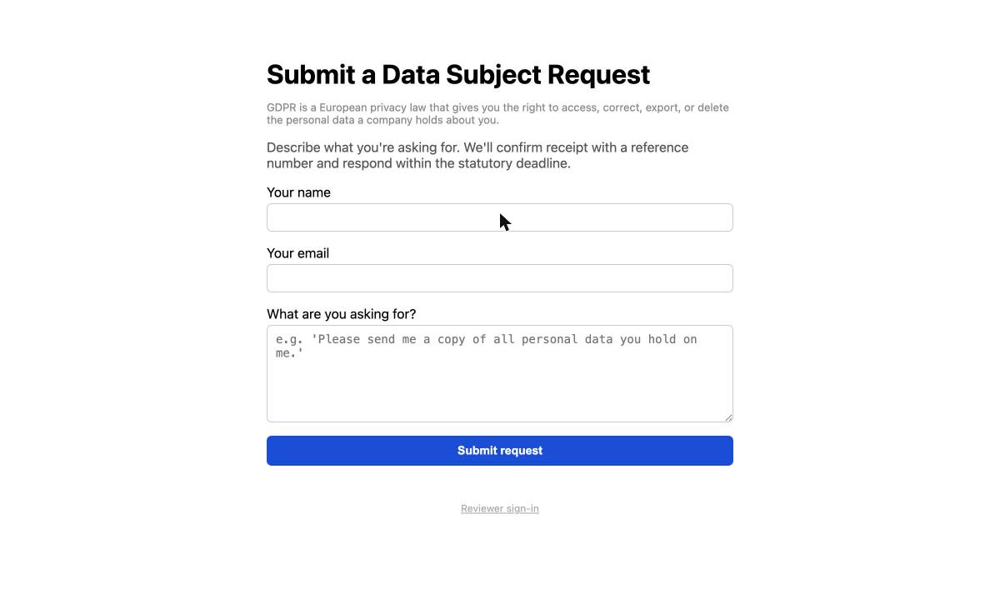
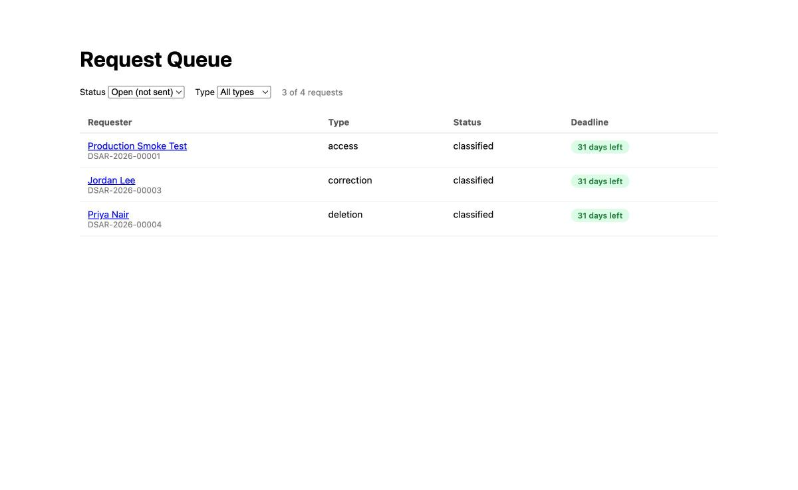
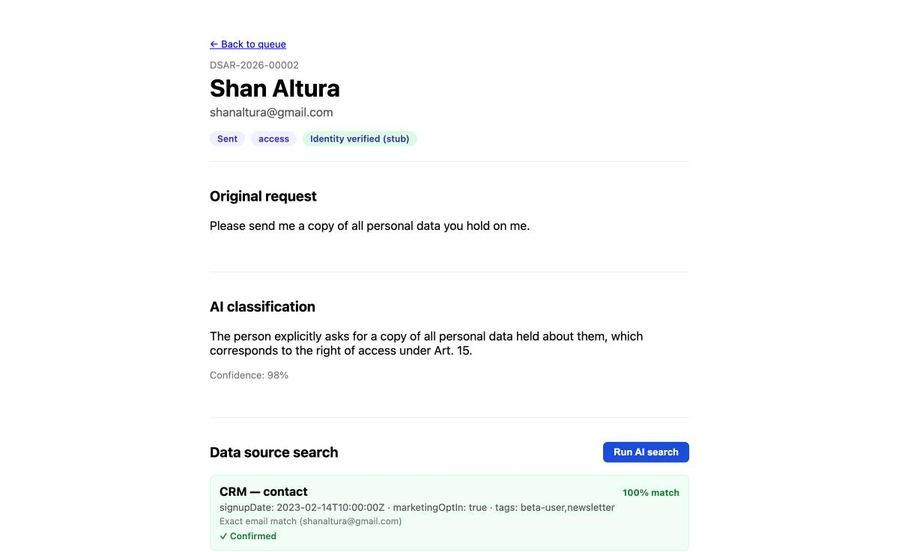
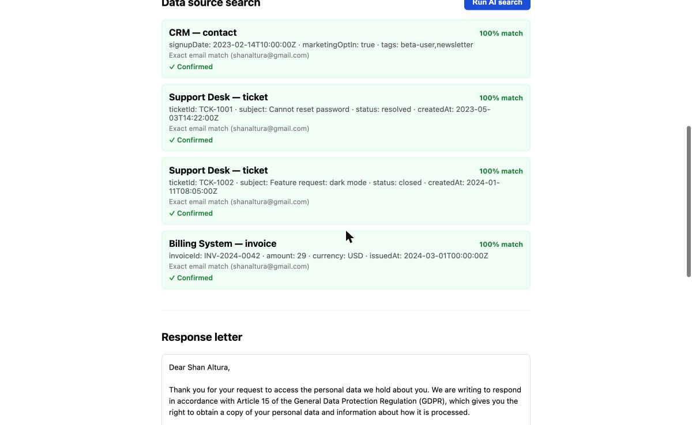
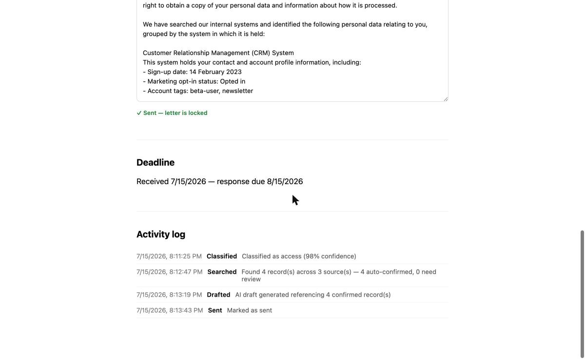

# GDPR DSAR Assistant

A tool for handling GDPR Data Subject Access Requests: intake → AI
classification → deadline-tracked dashboard → AI-driven search across mock
data sources via tool-calling → drafted response letter, with a full audit
trail.

**Live**: https://gdpr-dsar-assistant.vercel.app · **Repo**: this one

This app has two audiences: the public intake form anyone can submit, and
an internal reviewer queue that handles submitted requests. Those are
different people in real life (a data subject vs. a compliance reviewer),
so the app doesn't link them together — there's a small "Reviewer sign-in"
link in the footer of the intake page (no real login behind it; see Scope
& assumptions) if you want to see both sides in one session.

## The problem

Under GDPR, anyone can ask a company what personal data it holds on them,
to correct it, export it, or delete it — and the company has one calendar
month to respond (Art. 12(3)). In practice this means someone on a
compliance or support team has to: read the request and figure out what
it's actually asking for, manually search every internal system the
company runs (CRM, support desk, billing, whatever else) for that person's
records, decide whether a same-named-but-different person's data
accidentally got pulled in, write a formal response letter citing the
right article, and keep a defensible record of who did what and when —
all before the deadline, and all over again for every request that comes
in.

This project automates the parts of that workflow an LLM is actually good
at (reading intent, searching, drafting) while keeping a human explicitly
in the loop for the parts where a wrong guess has real consequences
(a low-confidence request type, an ambiguous name match, sending the
letter).

## Screenshots

| Intake | Queue |
|---|---|
|  |  |

| Classification | Search results |
|---|---|
|  |  |

**Drafted letter + audit trail**


All captured from the actually-deployed app, not local dev — the flow
you see is one real submission running end to end: intake → classified
(98% confidence, access request) → searched (4 records found across CRM,
Support, and Billing, all exact-email-matched) → drafted → sent, with
every step timestamped in the activity log.

## Architecture

```
┌──────────────┐        ┌───────────────────┐        ┌─────────────┐
│   Client     │──────▶│      Server        │──────▶│   Claude    │
│ React + Vite │  HTTP  │  Express + SQLite  │  API   │ (Anthropic) │
│  (Vercel)    │◀──────│    (Railway)        │◀──────│             │
└──────────────┘        └───────────────────┘        └─────────────┘
                                  │
                                  ▼
                         found_records (mock
                         CRM / Support / Billing
                         data, seeded once)
```

- **Client** — React + TypeScript SPA (Vite). Public intake form at `/`;
  reviewer-only queue at `/queue` and request detail at `/requests/:id`
  (no auth — see Scope & assumptions).
- **Server** — Express + TypeScript API, SQLite for storage
  (`better-sqlite3`). One request handler per workflow step; the AI calls
  live in `server/src/services/`.
- **AI** — Claude (`claude-opus-4-8` via `@anthropic-ai/sdk`), used three
  ways: structured-output classification, tool-calling search, and
  free-text letter drafting. See below for why search specifically uses
  tool-calling rather than a plain prompt.

## Why tool-calling for search, not just a prompt

The search step could have been "paste the mock records into the prompt
and ask Claude to find matches." That works for five seed records; it
doesn't reflect how this would actually integrate with a real company's
systems, and it hides a design question this project cares about
demonstrating: **the model should decide *where* to look, but a
human-auditable, deterministic function should decide *what counts as a
match*.**

So the search step is a real tool call: `search_data_sources(email, name,
sources)`. Claude receives a description of what each data source holds
and decides which ones are worth searching (for GDPR requests that's
usually "all of them," but the point is it's a judgment call the model
makes, not a hardcoded loop). The tool itself — `server/src/services/
search.ts` — runs a deterministic match: exact comparison on email,
Levenshtein-based similarity on name (`server/src/utils/fuzzyMatch.ts`).
Confidence and the human-readable reason ("Exact email match", "Name
similarity 67%...") come from that function, not from the model's own
assessment of its confidence — which matters, because asking an LLM to
self-report a calibrated confidence score is a well-known way to get
plausible-sounding numbers that don't actually track accuracy.

This is the same shape as MCP (Model Context Protocol): the model is
handed a tool with a schema, decides when and how to call it, and the
actual execution is opaque to the model and fully within your control. A
production version of this app would swap the mock `found_records` lookup
for real MCP servers in front of the CRM, support desk, and billing
systems — the `search_data_sources` tool boundary is already where that
swap would happen, and nothing about the classification or drafting logic
would need to change.

## Features

- **Intake** — public form, no auth required to submit. A one-line
  explanation of what GDPR is sits right under the heading, since most
  people submitting the form aren't privacy-law experts. Confirms with a
  human-readable reference number (`DSAR-2026-00001`) and the statutory
  deadline.
- **Classification** — Claude reads the free-text request and classifies
  it as access / deletion / portability / correction with a confidence
  score and rationale. High confidence auto-progresses the request; low
  confidence routes it to a `needs_review` state instead of guessing. A
  reviewer can always set or correct the type from a dropdown on the
  detail page — not just when the AI left it unset — and that override is
  itself an audit-logged event, distinct from the AI's own classification.
- **Reviewer queue** — sorted by deadline urgency, color-coded (green /
  yellow / red), filterable by status and type.
- **AI search** — tool-calling search across mock CRM/Support/Billing data
  sources with deterministic confidence scoring (see above). Anything
  below the confirm threshold is visually flagged and requires an explicit
  human click before it counts as "found."
- **Drafting** — Claude drafts a full response letter, but only ever sees
  *confirmed* records — an unconfirmed fuzzy match structurally cannot
  leak into a letter, because the draft endpoint filters before it ever
  builds the prompt.
- **Review & send** — the reviewer can edit the draft inline, save, then
  mark it sent. Once sent, the letter is locked — the server rejects
  further edits with a 409, not just a disabled button in the UI.
- **Audit log** — every classification, search, draft, edit, and send
  action writes an append-only, timestamped entry, visible chronologically
  on the request detail page.

## Design decisions & judgment calls

A few places in the spec described behavior qualitatively ("high/medium
confidence," "below a threshold") without giving numbers. Rather than
silently picking values, here's what was chosen and why — all easy to
retune once there's real usage data:

| Decision | Value | Where |
|---|---|---|
| Classification auto-progress threshold | confidence ≥ 0.6 | `server/src/services/classification.ts` |
| Search: minimum similarity to surface a name match at all | 0.5 | `server/src/utils/fuzzyMatch.ts` |
| Search: auto-confirm threshold | confidence ≥ 0.7 | `server/src/utils/fuzzyMatch.ts` |
| Statutory deadline | GDPR Art. 12(3)'s actual rule (1 calendar month, 28–31 days) rather than a flat "30 days" | `server/src/utils/deadlines.ts` |
| Draft regeneration | overwrites existing content/edits rather than versioning | `server/src/db/responseLettersRepo.ts` |

## Setup

```bash
npm install
cp .env.example server/.env   # fill in ANTHROPIC_API_KEY (required for classification)
```

Run both apps in dev mode:

```bash
npm run dev
```

- Server: http://localhost:4000
- Client: http://localhost:5173 (proxies `/api` to the server)

## Deploy

- **Client**: Vercel, static build (`vercel.json` points at `client/`).
  Push to `main` auto-deploys. Public URL:
  https://gdpr-dsar-assistant.vercel.app
- **Server**: Railway, persistent volume mounted at `/data` for the SQLite
  file (`DATABASE_PATH=/data/dsar.sqlite`). Deployed via `railway up` from
  `server/` — not git-connected (see note below), so deploys are manual for
  now: `railway up server --path-as-root --service server --detach`.
  Public URL: https://server-production-a299.up.railway.app

The client's `VITE_API_BASE_URL` (a Vercel production env var) points at
the Railway URL; the server's `CLIENT_ORIGIN` env var is set to the Vercel
URL for CORS. Both are plain HTTPS URLs, not secrets.

**Note on a real deploy bug, not just config.** `tsc` compiles `.ts` files
but doesn't copy non-TS assets — `dist/db/schema.sql` didn't exist after a
production build, so the deployed server crashed on boot reading it
(`ENOENT`). Fixed by copying it as a build step:
`"build": "tsc -p tsconfig.json && cp src/db/schema.sql dist/db/schema.sql"`.
This wasn't Railway-specific — `npm run build && npm start` was broken
locally too; local dev just never exercised it because `npm run dev` runs
`tsx` directly against `src/`, skipping the compiled build entirely. Caught
by actually running the production start command locally before trusting
the Railway deploy, not by staring at the config.

**Note on git-based deploys.** Vercel's GitHub App is connected to this
repo, so client pushes auto-deploy. Railway's isn't (would need the same
GitHub App authorization flow as Vercel required) — deferred since manual
`railway up` works fine for a portfolio project's cadence; revisit if this
becomes a real CI/CD requirement.

## Scope & assumptions

**Identity verification is out of scope.** Under GDPR Article 12(6),
controllers can require additional information to confirm a requester's
identity before acting on a request — this prevents fraudulent access or
deletion of another person's data. In production this would sit between
intake and search (e.g. an email verification token, or a second
identifier). For this project, requests are assumed pre-verified
(`verified: true` stub in the schema) so the demo can focus on
classification, search, and drafting logic.

**No authentication.** `/queue` and `/requests/:id` are "reviewer-only" by
URL convention, not by access control — there's no login system. The
"Reviewer sign-in" link on the intake page is a plain link to `/queue`,
not a login gate. Anyone with the link can view or act on any request.
Fine for a portfolio demo where the goal is letting one visitor explore
both personas; not fine for production, where intake and review would be
separate apps (or at minimum separate authenticated areas) so a requester
never has a path to another requester's data.

**Deterministic search stays deterministic.** The `search_data_sources`
tool's matching logic is intentionally *not* delegated to the model (see
Why tool-calling above) — this is a design choice, not a limitation to fix
later.

## Build history

Built sprint-by-sprint against an explicit backlog (Setup & Infrastructure
→ Data Model & Intake → Classification → Dashboard & SLA Tracking → Data
Source Search → Drafting/Audit Log/Polish), each sprint committed and
pushed separately, verified against the live Claude API in a real browser
before being called done — not just type-checked. Commit history is the
detailed record; this file documents the decisions that aren't obvious
from the diffs.

**Sprint 7** (post-launch polish): a GDPR one-liner on the intake form, a
reviewer-editable type dropdown (not just AI-set), and the discreet
reviewer-sign-in link described above.
